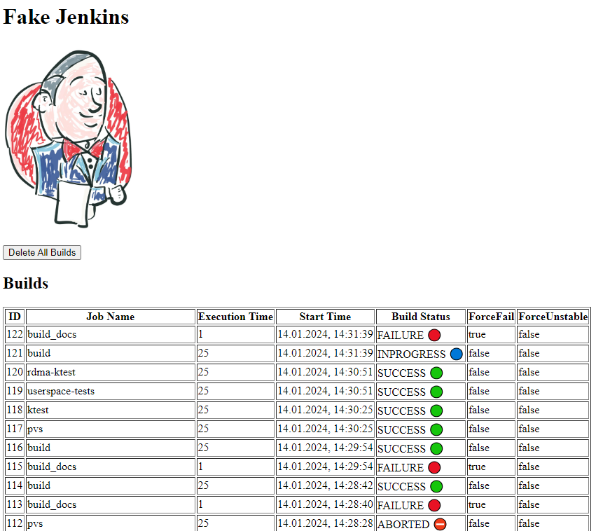

# FakeJenkins
Tool for mocking Jenkins  
  

FE ```localhost:8080```  

## Available API
#### Create Build of DEFAULT Job:  
``` POST /job/ANY_JOB_NAME/buildWithParameters?executionTime=10```  
Example:  
```curl -X POST -i localhost:8080/job/ANY_JOB_NAME/buildWithParameters?executionTime=10``` ->  
```7``` & ```headers[Location]: some/strange/url/7/```  

#### Get build info:  
``` GET /job/ANY_JOB_NAME/<build_number>/api/json```  
Example:  
```curl localhost:8080/job/default/6/api/json``` ->   
```{"artifacts":["artifact 1","artifact 2"],"queuId":6,"status":"SUCCESSFUL"}```   
First request after build creatio return INQUEUE status. Second - launch build &  
change status to INPROGRESS. Build became SUCCESSFUL if startTime + execTime >= currentTime  

#### Get job info:
```GET /job/DEFAULT/api/json```  
Example:  
```curl localhost:8080/job/DEFAULT/api/json``` ->   
```{"buildable":true,"inQueue":[{"ID":9,"ExecutionTime":10,"StartTime":"2024-01-10T13:55:25Z","BuildStatus":"INQUEUE","JobName":"DEFAULT"}]}```  

#### Get queue item:
```GET /queue/item/<queueNumber>/api/json```  
Example:  
```curl localhost:8080/queue/item/6/api/json``` ->   
```{"executable": {"number": 6}}```  

#### Delete all builds:  
```DELETE /deleteAllBuilds```  
Example:   
```curl -X DELETE -i localhost:8080/deleteAllBuilds``` ->  
```"Successful delete all"```


### Dev Launch

```go run .```  

### Prod Launch
For docker compose v2  
```docker compose build```  
```docker compose up -d```  
  
